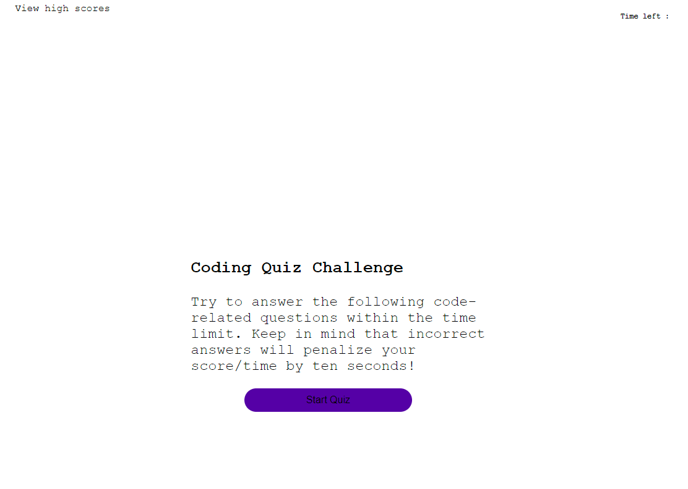

# Description
This app features a coding quiz which contains a codebase that mainly focuses on JavaScript; using the DOM to interact with HTML elements

The quiz contains five coding questions. 
The interface responds depending on if the user has clicked on the correct or incorrect answer. 

# Webpage

URL: https://erech.github.io/Coding-Quiz/
